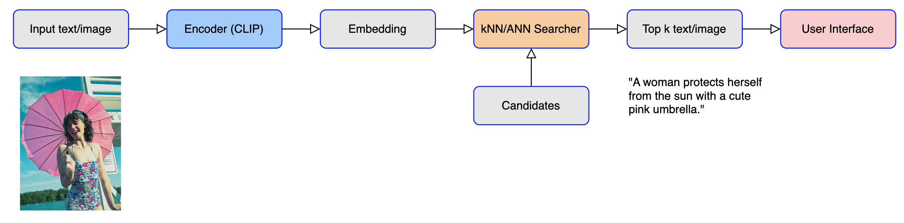
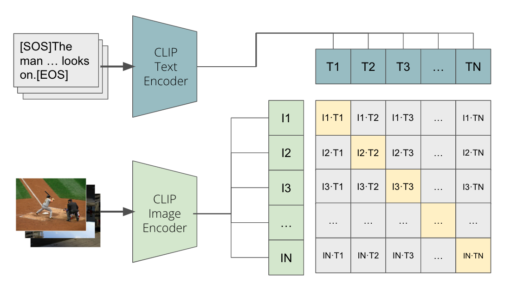

# Introduction

[Github](https://github.com/zyhhhy/Vectorized-Similarity-Search-in-Multi-modal-Databases) [Report](https://github.com/zyhhhy/Vectorized-Similarity-Search-in-Multi-modal-Databases/blob/main/report/Vectorized%20Similarity%20Search%20in%20Multi-modal%20Databases.pdf) [Demo(GPU)](http://18.237.16.206:8501/) [Demo(CPU)](http://34.168.201.92:8501/) [Presentation Slide](https://github.com/zyhhhy/Vectorized-Similarity-Search-in-Multi-modal-Databases/blob/main/presentation/Final%20Project%20ver2.pptx.pdf)

This is a class project on UCLA CS260 Machine Learning Algorithm advised by Professor [Quanquan Gu](https://web.cs.ucla.edu/~qgu/).

We build a multimodal database including texts and images, which can query images by texts, and vice versa. Textual and visual embeddings are extracted by the techniques of CLIP. kNN and ANN are used as similarity search strategies. We study the performance of this approach and achieve achieved 96% precision rate on MS-COCO dataset. Online demo is available at [Demo(GPU)](http://18.237.16.206:8501/) and [Demo(CPU)](http://34.168.201.92:8501/).



# Project Technology

The project has three major parts of technology, including fecture embedding, similarity search and user interface.

## Feature Embedding

We introduce Contrastive Language-Image Pre-training (CLIP) to embed texts and images into high-dimensional vector spaces and fine-tune pre-trained model to achieve better performance.

CLIP is a multimodal neural network architecture. It can process two kinds of input context which are images and their corresponding captions and gain their high-dimensional vectors. Then CLIP calculates the similarity between each image embedding vector and text embedding vector. Because each image has the highest similarity with its own caption, in the confusion matrix, the values on the diagonal should be the largest in each row and column. On this setting, CLIP jointly trains an image encoder and a text encoder to predict the correct pairings of a batch of (image, text) training samples.



## Similarity Search

We implement k-Nearest Neighbor (kNN) and Faiss Approximate k-Nearest Neighbor (ANN) to conduct multimodal similarity searches, which include image to text, image to image, text to image, and text to text functions.

Let $q$ be the query vector, and $\{c_i\}^n_{i=1}$ be the search candidates. The KNN algorithm ranks $\{c_i\}^n_{i=1}$ by similarity scores $\{s(q,c_i)\}^n_{i=1}$ with descending order and return the first k candidates as final answers.

We utilize Meta Faiss IVF algorithm as our ANN model. To begin with, it partitions all candidates into m groups and computes the center point of each group as representative. For each query q, it first computes similarity scores with m representatives and selects the most similar t ones. Then, only the candidates within these t groups will be considered to calculate similarities. Like kNN, the most similar k ones will be returned.

## User Interface

We use an open-source python library Streamlit to construct user interface. It makes everyone can access to and test our work through web easily and dynamically.

For more details, you can read our project [report](https://github.com/zyhhhy/Vectorized-Similarity-Search-in-Multi-modal-Databases/blob/main/report/Vectorized%20Similarity%20Search%20in%20Multi-modal%20Databases.pdf). Please feel free to give me more advice for my further development.


# Implementation Details

When we are developing the user interface, we come accoss many problems.

1. Every time we open the website, it will first spend a long time creating index (faiss index) on ANN mode
2. Every time we query text by image, the GPU memory will increase until it causes OOM error
3. Sometimes we upload an image on the website, the image will rotate upsidedown automatically

## Streamlit Cache

When ANN begins, it will first create index for the whole database and this always costs a very long time. Even I change some options, streamlit UI will create the index again. This can obviously upset users.

I learn from the Internet that streamlit has cache to stage important data and do not need to reload them again and again.

At first, I wrap the create index function in a function and descripted by `@st.cache(allow_output_mutation=True)`. But the problem is not solved. The page will still create index.

Later I realize that I should cache the offline data rather that the online creating process. So I use `faiss.write_index` function to save the index on the disk and use `faiss.read_index` function to load it. 

This time the cache can stage these index and do not need to load them frequently. 

## OOM error

Every time we click the "generate" button to query text by image, the GPU memory will increase around 180MB. What's more important is that, the memory will not release unless we stop the streamlit process. This drives me crazy because it means that I have to restart the service usually.

The pipeline of this process is that:

1. Get the embedding vector of this image and move it to the designed device (eg. GPU)
2. Load the text embeddings and move it to the designed device
3. Get the most similar text embedding with this image vector and return

At first, I believe that it is the movement of embeddings from CPU to GPU causes this problem. So I try to let them stay on CPU and finish KNN calculation. But this results in longer computing time.

I also try to use `torch.cuda.empty_cache()` and delete embedding vectors after finish the calculation. But the problem is still there.

Later, I use pdb to debug the program and find that when the image vector is generated and moved to GPU, the memory has already increased. The image2vector function is shown below.

```python
def image2vector(model, image):
    image_feature = model.encode_image(
        preprocess(image).clone().detach().to(device).unsqueeze(0)
    ).float()
    return image_feature
```

I search from the Internet and find that if the tensor has gradients, it will not automatically release. So I add `@torch.no_grad()` before the function and finally solve the problem.

This time when GPU process an image, it will only use a fixed number of memory (create for the first time). This system can run normally forever.

## Image EXIF

We find that some uploaded images rotate upside-down automatically. We later find that these images have EXIF (Exchangeable Image File Format) with rotation value equals to 3 which means that they are upside-down when they are taken.

We use the `ImageOps.exif_transpose` function in the `PIL`  package to solve the problem.

# Project Management

I am the leader of this team. My teammates are Jo-Hua Wu, Yu-Ruei Chang and Yi-An Chen.


To be honest, working with them is a pleasure for me. I feel happy and released after the project. But I also want to list some difficulties when I was leading this team.

The first problem is that we meet weekly on Tuesday and I cannot really connect to my teammates and push the process on the other time. We form a chat group both on WeChat and Line. But they chat less and do not have a quick response in the group except for one person Jo-Hua Wu. I think if for the next cooperation, I should make a week plan to give everyone the direction of our group. And apart from weekly meeting in person, we can also have online meetings sometimes to check the process of everyone.

The second problem is that our workload is not very balanced. Wu's and my work is more than others. I think this is not very fair for the whole team. I am not complaining about my overload. I think I should take this responsibility. But for the next time, I should not do every thing by myself. I should not be a manager and a worker. As the leader, I should be a supporter and a guider for my teammates to finish the task together. Maybe I can start the program early and teach others how to continue the work.

The last problem is that we have no review process. Everyone just finish his/her work and don't know what others have done. This is terrible because we cannot learn knowledge on others' parts. I think we can have some sharing time on the meeting for everyone's work in the next time.

All in all, this cooperation is pleasant and can be better. I will continue to improve my leadership skills. 